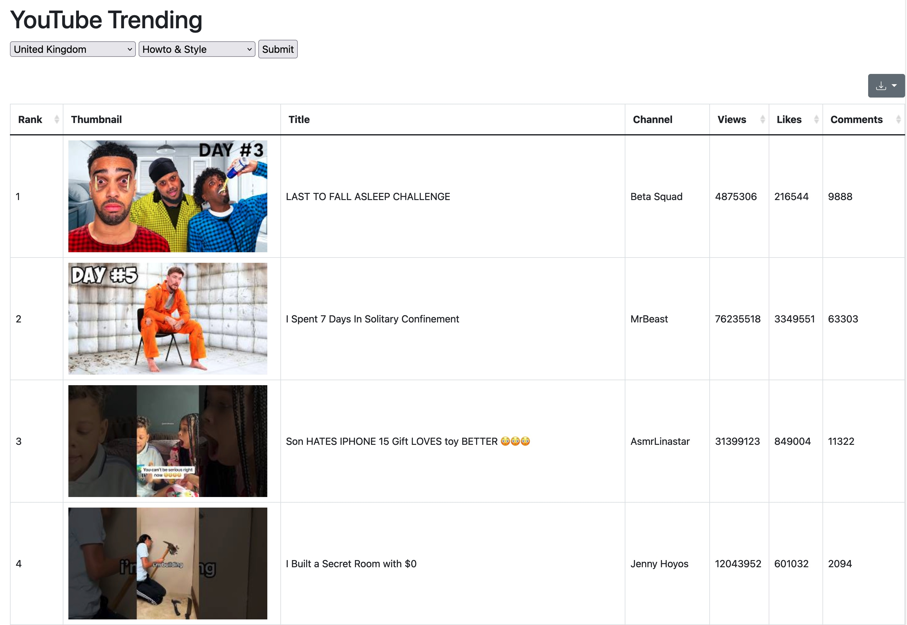

# YouTube Trending Explorer

A simple Flask app to view trending YouTube video in various countries. 




## Features
- Filter trending video by region and category
- Export result to csv/xlsx/json/etc..
- Basic API to call

## Installation

1. **Get a YouTube API Key**
   
- Here's a good tutorial: [How to Get a YouTube API Key](https://blog.hubspot.com/website/how-to-get-youtube-api-key)

2. **Run it on Docker:**

  ```bash
docker run -p 5000:5000 -e API_KEY=YOUR_API_KEY -d ok3721/youtube-trending-explorer:v0.1
  ```
> For extra security, you can set up API key as secrets in Docker Compose, see [How to use secrets in Docker Compose](https://docs.docker.com/compose/use-secrets/) for more info.


## Usage
- **Web:**
Visit [localhost:5000](http://localhost:5000), click Submit after select category and region.
> Note: some categories may return empty results

- **API:** Send an HTTP GET request to `/returnjson`. There are two parameters, `region` and `category`. `region` takes [ISO standard two-letter country codes](https://en.wikipedia.org/wiki/ISO_3166-1_alpha-2), and `category` takes [YouTube video category ID](https://gist.github.com/dgp/1b24bf2961521bd75d6c).
An example url: `/returnjson?region=US&category=17`

## Credits
[Bootstrap Table](https://bootstrap-table.com)
